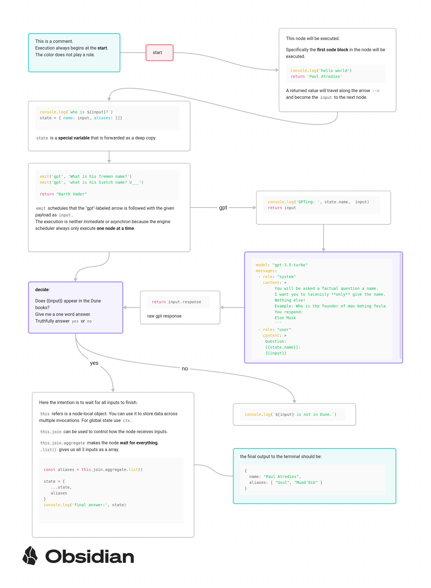

# obsidian-node-canvas

This is what this is about:



**Obsidan-Node-Canvas** is a `javascript`-based workflow/scripting engine build on top of [obsidian](https://obsidian.md/)  (the popular and powerful journaling, knowledge bases, and project management tool ) - and specifically https://obsidian.md/canvas.

Using Obsidan-Node-Canvas requires at least basic understanding `javascript`-programming. 

You could use it to automate things in your obsidian-vault - but the main obsidian connection is that obsidian acts as a frontend - what you build is up to you. 

**Obsidan-Node-Canvas** makes it possible to:

- ✅ visually _compose_ "function"-blocks (nodes on a canvas) and **execute** them
- intuitively combine:
  - ✅ the powers of LLMs (integration)
  - ✅ the powers of browser automation (e.g. [Puppeteer](https://pptr.dev/))
  - ✅ the powers of REST-APIs and the [npm-ecosystem](https://docs.npmjs.com/about-npm)
- utilize custom state-propagation ➡️, flow-splitting, flow-merging 🔀 and aggregation to express you use-cases visually (see features / examples)
- 🔨 integrate and automate within you obsidian vault
- 🔨 visually _**compose**_ reusable snippets and canvases
- [ ] many more things are planned (see [section: plans](#plans))


| Stage     | Emoji |
|-----------|-------|
| Planned   | ☐     |
| Prototyped| 🔨    |
| Done      | ✅    |


## Conception

**Obsidan-Node-Canvas** has been _**conceived**_ 💥 and _**prototyped**_ 🚀 during the **[Code 2 Community - The Y Berlin x ICP](https://lu.ma/zwblit5f) hackathon**.

This project has been submitted [here](https://dacade.org/communities/icp/challenges/b35bd8af-51d3-437a-af13-4e649529c7e5/submissions/5605d208-bb84-4551-9697-e89f75901ce0).


## Features

tutorials are planned - for now look at the canvases in the [examples folder](./examples).


## how to run

> Warning: install run at your own risk. Do not execute `.canvas` that you do not understand.

- clone this repo
- be sure you have a recent `node` version installed. I used v20.10.0
- install via [yarn](https://yarnpkg.com/) 

- create a `.env` file
  - containing `OPENAI_API_KEY=<YOURKEYHERE>`
  - this is needed as the tutorial.canvas uses LLM-nodes

- then:
```bash
# from the checkout root call:

yarn install # install dependencies
yarn dev --vault examples --canvas tutorial/tutorial.canvas
```

Off you go with your own canvas 🕊️

Wanna collaborate / contribute / follow the development then join the [telegram](https://t.me/+ALF9UwRxAwIzZDli)

### compatibility

Depending on you specific package dependencies you can also run https://bun.sh/ but that would bring some compatibility issues with specific  e.g. `jsdom` which you then would not be able to use in canvases. 

OS support:
- I tested only on Ubuntu 20
- Mac should work as well
- windows might work - in case of trouble use WSL
    

## plans

features and improvements in no particular order:

- slightly rework special scope variables (aka stabelize api)
  - `ctx`, `state`, `this`
- documentation
    - make a youtube tutorial
- node mechanics
  - allow writing directly to file via `|` and `>` edge-labls
  - allows `md`-files _referencing_ for **resuable nodes** 
  - allow _referencing_ entire `.canvas` files 
  - add custom join / aggregation nodes
  - allow aggregation in presence of circular flow constellation 
    - via aggregation-start node...
  - detect not supported configurations
    - like aggregation-nodes combined with circular nodes dependencies
- add new **special purpose nodes**
  - **LLM** nodes
    - LLM-Tool use node
    - LLM conversational steps
    - allow multi agent interaction
    - **providers**
      - **local** ollama
      - mistral 
      - openai
      - dall-E
  - special web-crawl nodes (via puppeteer)
    - extract selector
    - load page node
    - page interaction node
    - firefox reading view node
  - obsidian specific nodes
    - allow to use dataview / dataviewjs blocks as input
    - allow intuitive updating of markdown
- web technology
  - add http endpoint node
  - support jsx / tsx code blocks
  - allow web-based **visual** introspection `--debug-server`
    - allow node by node stepping
    - allow to inspect internal node state
- publish 
  - as obsidian plugin
  - via npm so that `npx` works
  - allow a library build-target so that a `.chart` can consumed .e.g. as esmodule
- code loading
  - evaluate option to dynamically load via `--unpkg` from https://www.unpkg.com 
  - evaluate [deno](https://deno.com/)
  - document [bun](bun.sh) usage
