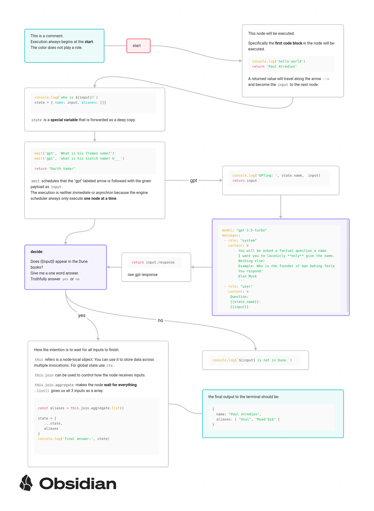

# obsidian-node-canvas

**Warning**: WIP - prototyping not yet completed

**Obsidan-Node-Canvas** is a `javascript`-based workflow/scripting engine build on top of [obsidian](https://obsidian.md/)  (the popular and powerful journaling, knowledge bases, and project management tool ).

Using Obsidan-Node-Canvas requires at least basic understanding `javascript`-programming. The **target audience** are **obsidian power-users** that want to supercharge what's possible with obsidian.

**Obsidan-Node-Canvas** makes it possible to:

- ✅ visually _compose_ "function"-blocks (nodes on a canvas) and **execute** them
- intuitively combine:
  - ✅ the powers of LLMs (integration)
  - ✅ the powers of browser automation (e.g. [Puppeteer](https://pptr.dev/))
  - ✅ the powers of REST-APIs and the [npm-ecosystem](https://docs.npmjs.com/about-npm)
- utilize custom state-propagation ➡️, flow-splitting, flow-merging 🔀 and aggregation to express you use-cases visually (see features / examples)
- 🔨 integrate and automate within you obsidian vault
- 🔨 visually _**compose**_ reusable snippets and canvases
- [ ] serve as a technological-foundation
  - allow to tie together vaults via smart contacts ([section: plans](#plans))


| Stage     | Emoji |
|-----------|-------|
| Planned   | ☐     |
| Prototyped| 🔨    |
| Done      | ✅    |


## Conception

**Obsidan-Node-Canvas** has been _**conceived**_ 💥 and _**prototyped**_ 🚀 during the [Code 2 Community - The Y Berlin x ICP](https://lu.ma/zwblit5f) hackathon.

The prototype has been _**put to use**_ during the hackathon to:
 - pull data from the [CoFi-Berlin cummunity obsidian vault](https://github.com/luizfernandosg/CoFi-Berlin)
 - pull data from https://www.gaianet.earth/ecosystem
 - enrich the data in order finally:
 - to **ingest** into the https://moos-map.de/ fellow hackathon-project
 - to visualize word embeddings from the https://moos-map.de/ 

### What was build during the hackathon?

**All code** in this repository was created during the hackathon.

This codebase reads a `.canvas` file typically created using https://obsidian.md/canvas.
Such a canvas typically used to create mind maps and _obsidian has no build in canvas code execution abilities_.

Those abilities come through this repo via a (currently standalone cli). 
Bundling into a [obsidian community plugin](https://obsidian.md/plugins) is [planned](#planned) but beyond hackathon scope.

This repo therefore provides a cli-executable `yarn dev --vault ./examples --canvas tutorial.canvas`.
This then will:
  - parse the `.canvas`
  - execute the contained instructions
    - which can be plain javascript or typscript
    - or be custom `yaml`-format instructions to e.g. write a file or call GPT
  - follow flow set out by arrows
    - allow splitting (✅) and merging (🔨) of flows 


https://gist.github.com/Davidiusdadi/df608c0c92f84d135308f82af68ecc97

## Feature tour

This sections will gives a basic feature tour.

In addition, you can:

- If _you have obsidian_:
  - you can check out the `/examples`-folders and specifically the `turorial.canvas`.
- If _you want an advanced example_:
   - see `examples/hackaton`:
    - those canvases were created/used during the hackathon 
    - they exemplify the full power of what is possible with the prototype




## Pictures


Here we see a dataset being loaded - contained urls being crawled and then
checked by GPT-3.5 for contained addresses. Not fully visible is the part that resolves these addresses into geo-coordinates. 


## Goal

High level goal:

- supercharge the natural abilities of [obsidian](https://obsidian.md/) 
  - markdown authoring
  - file embedding and 2 way linking
  - rich plugin ecosystem e.g. [obsidian dataview](https://blacksmithgu.github.io/obsidian-dataview/)
- by enabling dynamic & intuitive incorporation of tooling like
  - web scraping (e.g. https://pptr.dev/)
  - AI / LLM integration 
    - e.g. [gpt-3](https://openai.com/gpt-3/)
  - npm ecosystem

### Code 2 Community Pitch

The need obsidian-node-canvas arose during the hackathon as a way of bridging between multiple hackathon projects.

- e.g. the https://moos-map.de/ team could benefit from:
   - **ingesting datasource**
     - e.g. [CoFi-Berlin network data](https://github.com/luizfernandosg/CoFi-Berlin/tree/main )
     - data from [Gaianet ecosystem data](https://airtable.com/appVC7loBsmy3fcJw/shrb2A5dyfF0XofUr/tblQVaLTcxW9ARaoV/viwDKhVwxUq1Fy5rG/recfY0V17QSIHHqbC)
  - **novel API prototyping** 
    - for a custom GPT integration
    - for novel visualizations

After some initial [API prototyping](https://github.com/utopia-os/utopia-mesh-api) it became clear that this kind of offshoots or minor "hacks" would be of limited value.

From there the question arose, how to serve all these needs of the temporary hackathon community @ Moos while creating tangible value beyond the hackathon. As already a obsidian power-user I figured that I could create "something really awesome" in no time if I'd use the already pretty obsidian canvas as a foundation. 

From there I worked on:
  - using ONC to create t-sne based visualization based on the utopia-mesh-api
  - crawling and ingesting datasources
  - prototyping the execution rules including
    - execution follows arrows
    - using named arrows (emits)
    - logic for
      - splitting and joining flow
      - using file embeds

### how to run

Details coming soon **but** it's a normal node app that you need to run and poin to the `.canvas` file which you have most like created using Obsidian.


example invocation: 
```bash
yarn install
yarn dev --vault /home/david/prv/code/obsidian-node-canvas/examples --canvas path/mycanvas.canvas --debug

```


### compatibility

Your OS needs to be able to run [nodejs](https://nodejs.org/en) > 20.x. Depending on you specific package dependencies you can also run https://bun.sh/ but that would bring some compatibility issues with specific  e.g. `jsdom` which you then would not be able to use in canvases. 

OS support:
- I tested only on Ubuntu 20
- Mac should work as well
- windows might work - in case of trouble use WSL
    


## plans

features and improvements in no particular order:

- slightly rework special scope variables (aka stabelize api)
  - `ctx`, `state`, `this`
- documentation
    - make a youtube tutorial
- node mechanics
  - allow writing directly to file via `|` and `>` edge-labls
  - allows `md`-files _referencing_ for **resuable nodes** 
  - allow _referencing_ entire `.canvas` files 
  - add custom join / aggregation nodes
  - allow aggregation in presence of circular flow constellation 
    - via aggregation-start node...
  - detect not supported configurations
    - like aggregation-nodes combined with circular nodes dependencies
- add new **special purpose nodes**
  - **LLM** nodes
    - LLM-Tool use node
    - LLM conversational steps
    - allow multi agent interaction
    - **providers**
      - **local** ollama
      - mistral 
      - openai
      - dall-E
  - special web-crawl nodes (via puppeteer)
    - extract selector
    - load page node
    - page interaction node
    - firefox reading view node
  - obsidian specific nodes
    - allow to use dataview / dataviewjs blocks as input
    - allow intuitive updating of markdown
- web technology
  - add http endpoint node
  - support jsx / tsx code blocks
  - allow web-based **visual** introspection `--debug-server`
    - allow node by node stepping
    - allow to inspect internal node state
- publish 
  - as obsidian plugin
  - via npm so that `npx` works
  - allow a library build-target so that a `.chart` can consumed .e.g. as esmodule
- code loading
  - evaluate option to dynamically load via `--unpkg` from https://www.unpkg.com 
  - evaluate [deno](https://deno.com/)
  - document [bun](bun.sh) usage
