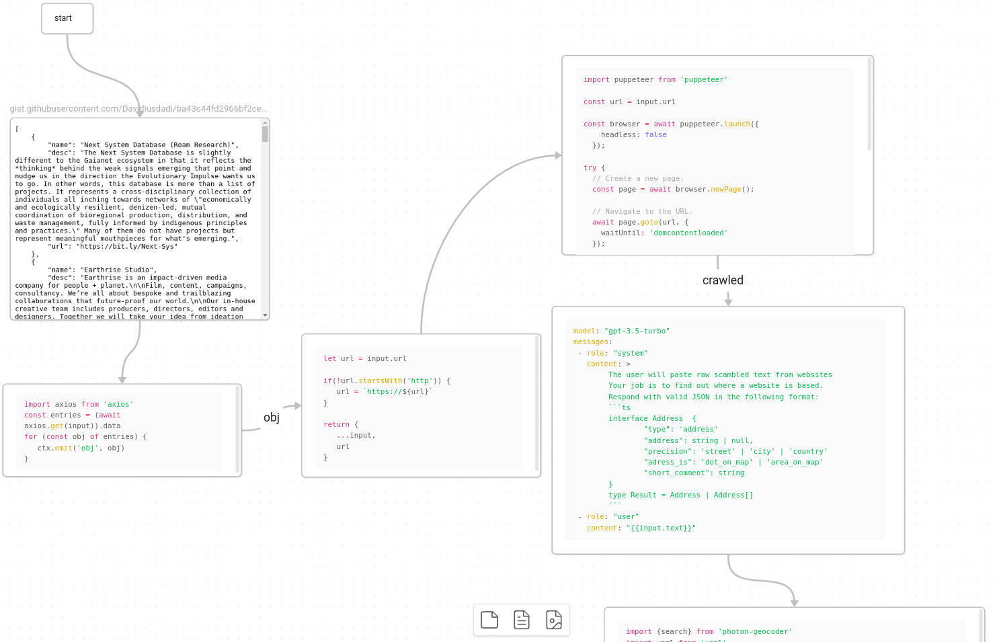

# obsidian-node-canvas

**Warning**: WIP - prototyping not yet completed

A node execution engine driven by [obsidian canvas](https://obsidian.md/canvas) [using [jsoncanvas](https://jsoncanvas.org/) format].

This project was conceived & prototyped during the [Code 2 Community - The Y Berlin x ICP](https://lu.ma/zwblit5f) hackathon. :tada: :explosion:.

## Pictures



Here we see a dataset being loaded - contained urls being crawled and then
checked by GPT-3.5 for contained addresses. Not fully visible is the part that resolves these addresses into geo-coordinates. 


## Goal

High level goal:

- supercharge the natural abilities of [obsidian](https://obsidian.md/) 
  - markdown authoring
  - file embedding and 2 way linking
  - rich plugin ecosystem e.g. [obsidian dataview](https://blacksmithgu.github.io/obsidian-dataview/)
- by enabling dynamic & intuitive incorporation of tooling like
  - web scraping (e.g. https://pptr.dev/)
  - AI / LLM integration 
    - e.g. [gpt-3](https://openai.com/gpt-3/)
  - npm ecosystem

### Code 2 Community Pitch

The need obsidian-node-canvas arose during the hackathon as a way of bridging between multiple hackathon projects.

- e.g. the https://moos-map.de/ team could benefit from:
   - **ingesting datasource**
     - e.g. [CoFi-Berlin network data](https://github.com/luizfernandosg/CoFi-Berlin/tree/main )
     - data from [Gaianet ecosystem data](https://airtable.com/appVC7loBsmy3fcJw/shrb2A5dyfF0XofUr/tblQVaLTcxW9ARaoV/viwDKhVwxUq1Fy5rG/recfY0V17QSIHHqbC)
  - **novel API prototyping** 
    - for a custom GPT integration
    - for novel visualizations

After some initial [API prototyping](https://github.com/utopia-os/utopia-mesh-api) it became clear that this kind of offshoots or minor "hacks" would be of limited value.


### how to run

Details coming soon **but** it's a normal node app that you need to run and poin to the `.canvas` file which you have most like created using Obsidian.


example invocation: 
```bash
yarn install
yarn dev --vault /home/david/prv/code/obsidian-node-canvas/examples --canvas path/mycanvas.canvas --debug

```


### compatibility

Your OS needs to be able to run node > 20.x. Depending on you specific package dependencies you can also run https://bun.sh/ but that would bring some compatibility issues with specific  e.g. `jsdom` which you then would not be able to use in canvases. I tested only on Ubuntu 20.

